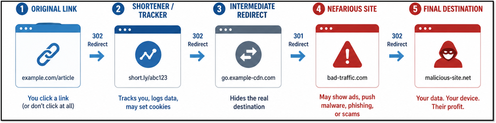

# Project Sketchy Parking Lot: Unsupervised Learning for Suspicious Patterns in Parked and Dormant Domains

## Context
Parked websites are dangerous, opaque redirect hubs that can hide malicious activity through zero-click redirect chains exposing users to harm with no visible interactions.

> We define "suspicious domains" as potentially exploitable redirects starting from trusted, reputable parked pages and providers.



## Project Objective
Our objective is to design a Python-based microservice suitable for integration into security analysis workflows that will score parked webpages based on observed behavioral and content signals. It is designed as a containerized Python pipeline to ensure consistent execution across environments when using intended proprietary cybersecurity data.

## Approach
The system follows a multi-signal analytical approach that integrates data collection, feature extraction, and scoring into a unified pipeline. It processes parked web page data to capture a range of behavioral and content-based indicators, which are transformed into structured features for analysis. These features are evaluated using **unsupervised learning** methods (isolation forest and k-means) for scoring and anomaly detection to identify patterns associated with deceptive or abuse-prone infrastructure. The approach prioritizes scalability, modularity, and interpretability, allowing the system to adapt as additional signals and data sources are incorporated. We test the accuracy of the results by manually reviewing the outputs because we don't have reliably labeled data, hence the importance of this project.

## Aspirational Future Work
- Evaluate different behaviors of a singular domain using **different IP origins** (through proxy servers) and browser type. IP origins should differentiate by State or Country. Browsers for consideration are Brave, Firefox, Safari, and Microsoft Edge
- More **robust anomaly validation** with threat intelligence or reputation feeds

## Signals Considered
The system evaluates a diverse set of signals capturing structural, behavioral, and content-level characteristics of parked web pages. These include indicators derived from page content, redirect behavior, and observable patterns in page structure and composition. Features are designed to capture anomalies, repetition, monetization signals, and deviations from typical inactive page behavior.

### Dataset Descriptions
- Domain-level records including URL, subdomain, domain name, and top-level domain (TLD)
- Webpage metadata such as title and text snippet of html
- Redirect chain and hop count behavior

### Highlighted Engineered Features
- Top phrases in content creates "ad_score", "parked_score", "suspicious_score"

- Using jaccard similiarty as a numerical metric, our redirect chain analysis produces "num_redirects", "avg_redirect_jaccard", "min_redirect_jaccard", "low_redirect_similarity_flag", "first_last_redirect_similarity"

- FastText language detection model on title & content identifies language-to-TLD mismatch analysis "lang_tld_mismatch"

## Threat Score Distribution using Isolation Forest 


## Project Structure
```text
sketchy-parking-lot/
├── models/
│   └── lid.176.ftz
├── notebooks/
│   └── wrangling_analysis.ipynb
├── outputs/
├── src/
│   ├── run_pipeline.py
│   ├── sketchy_features.py
│   ├── sketchy_lang_id.py
│   ├── sketchy_tokenizer.py
│   └── sketchy_unsupervised_models.py
├── Dockerfile
├── README.md
├── requirements.txt
└── run_pipeline.sh
```

## Running the Project (Docker)
### Build the Docker image
From the root of the repository:
```bash
docker build -t sketchy-parking-lot .
```

### Run the pipeline

**Important note:** Our data importing function in `src/sketchy_tokenizer.py` is configured based on our project's proprietary data. Also, you must match your data's column names to the naming convention used in our `src/sketchy_...` python classes. 

Execute the container:
```bash
docker run --rm \
  -u $(id -u):$(id -g) \
  -v "$(pwd)/data:/app/data" \
  -v "$(pwd)/outputs:/app/outputs" \
  sketchy-parking-lot
```

## Acknowledgments
This project was developed as part of a capstone project with the University of Arizona focused on suspicious pattern detection in parked and dormant web infrastructure.
